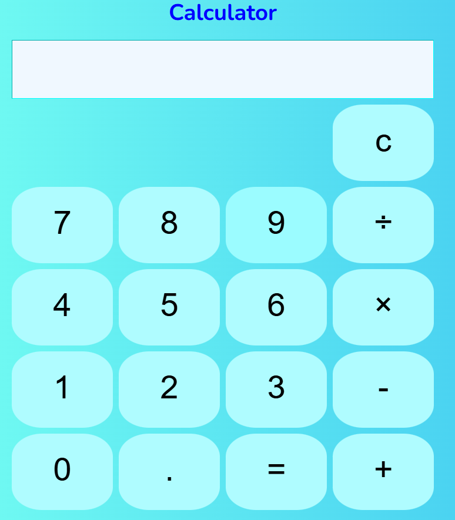

# Calculator App 🔢

> A simple calculator built using **HTML, CSS, and JavaScript**  
> My second web project during my web developer journey
  
---

## 🚀 About the Project

This project was built to practice JavaScript **DOM manipulation, event handling, and state management**.

### 📌 Key objectives:
- Build a basic interactive calculator interface
- Support basic math operations
- Handle continuous calculations (e.g., `3 + 4 + 5 +`)
- Minimize JavaScript code while maintaining readability
- Debug and solve issues during learning

---

## ✨ Features

- Basic arithmetic operations: `+`, `-`, `×`, `÷`
- Continuous input logic (`+++`)
- Clear button to reset
- Responsive layout (CSS Grid or Flexbox)
- Clean UI with hover effect

---

## 📂 Files Structure

```plaintext
calculator/
├── index.html
├── app.css
├── script.js
├── README.md
└── calculator.png

💻 How to Use
1. Clone or download this repository
2. Open index.html directly in any modern browser
3. Start calculating!

📸Screenshots


🙋‍♀️ Author
Made with 💙 by Nuttamon Namwongpisut (Mimi)
GitHub: @nnuttamon

📜 License
Open-sourced under the MIT License.